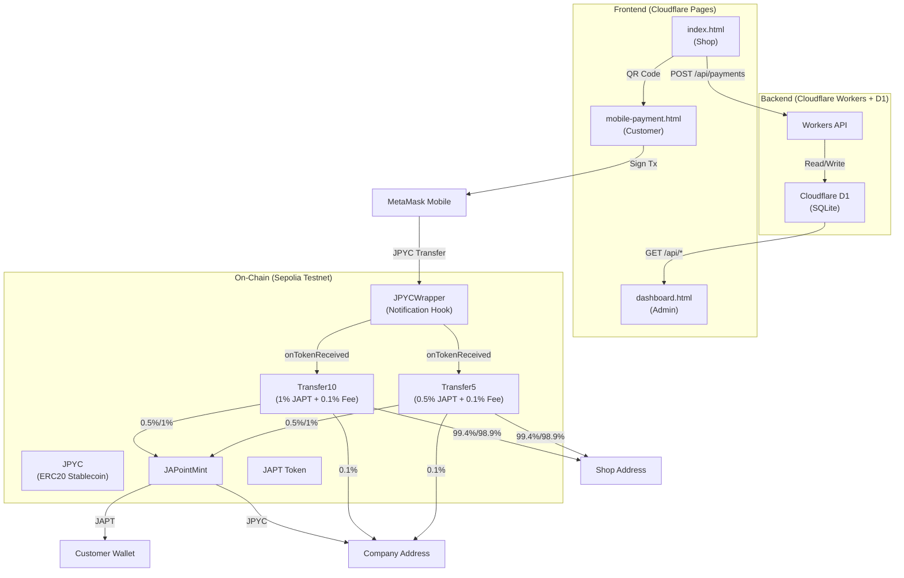
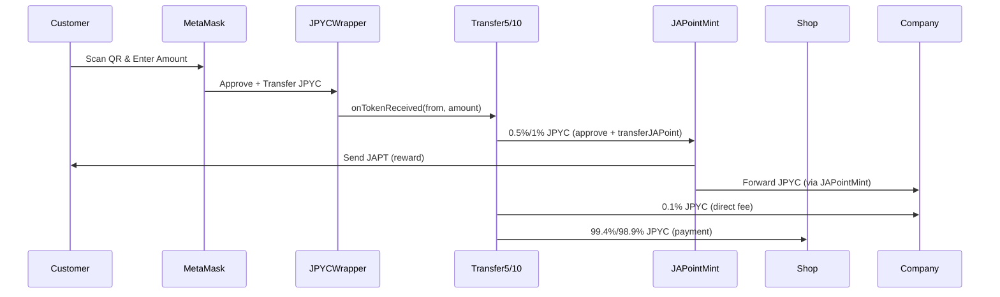
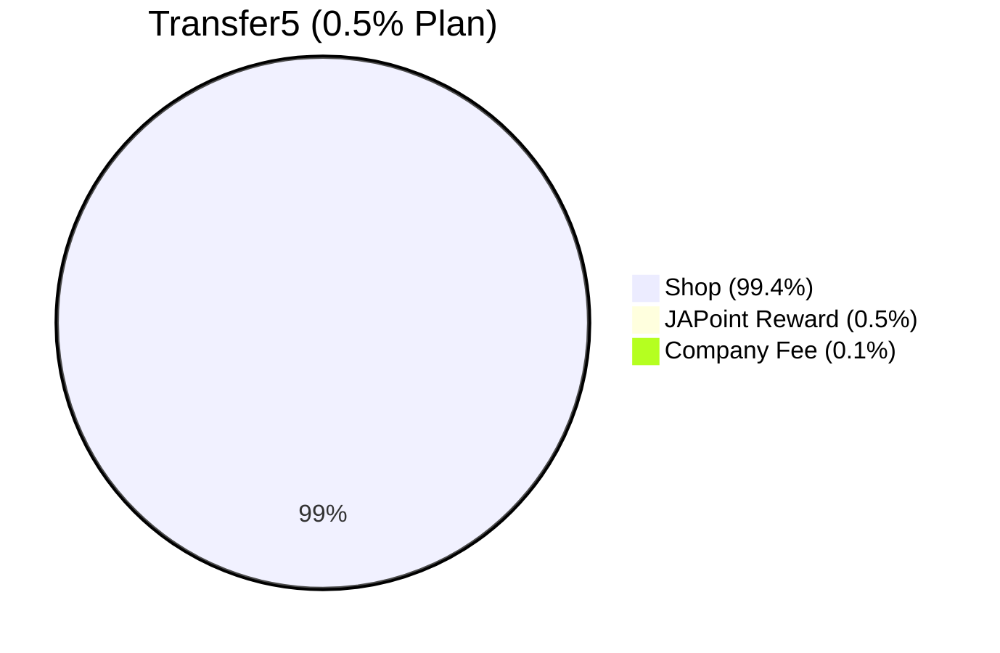
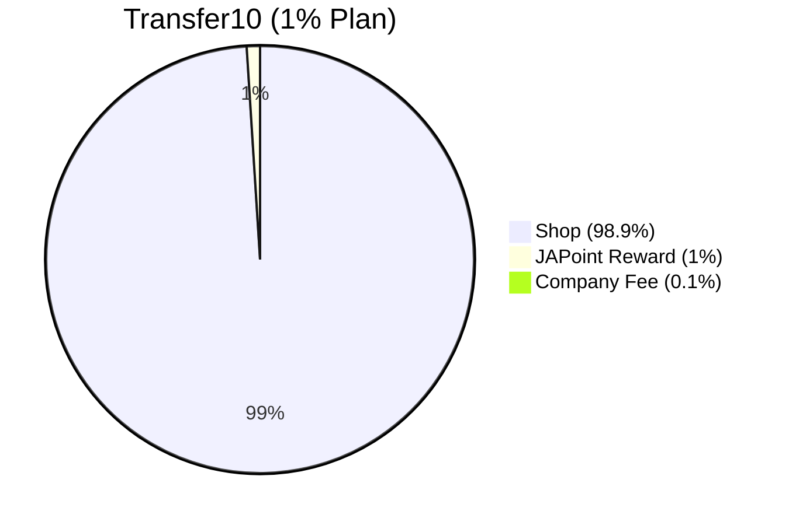

# JAPOINT Payment System

A complete stablecoin payment and reward system built with Solidity and Foundry. Customers pay with JPYC (Japanese Yen stablecoin) and receive JAPT (JAPoint) tokens as rewards.

## Live Demo

- **Payment System**: https://japoint-payment.pages.dev
- **API**: https://japoint-api.kkuejo.workers.dev

## System Architecture



## Payment Flow



## Fund Distribution





## Tech Stack

### Frontend
| Technology | Purpose |
|------------|---------|
| HTML/CSS/JavaScript | User Interface |
| ethers.js | Ethereum integration (v5.7.2 mobile, v6.9.0 desktop) |
| QRCode.js | QR code generation |
| Cloudflare Pages | Hosting |

### Backend API
| Technology | Purpose |
|------------|---------|
| Cloudflare Workers | Serverless API |
| Cloudflare D1 | SQLite database |
| Wrangler | Deployment tool |

### Smart Contracts
| Technology | Purpose |
|------------|---------|
| Solidity ^0.8.20 | Contract language |
| OpenZeppelin | Security library |
| Foundry | Development & testing |

### Network
| Item | Value |
|------|-------|
| Chain | Ethereum Sepolia Testnet |
| Chain ID | 11155111 |

## Smart Contracts

### Contract Overview

| Contract | Purpose | Fee |
|----------|---------|-----|
| JPYC | Japanese Yen stablecoin (existing) | - |
| JAPT (JAPoint) | Reward token (ERC20) | - |
| JPYCWrapper | Adds notification to JPYC transfers | - |
| Transfer5 | Payment processor (low fee) | 0.6% (0.5% JAPT + 0.1% fee) |
| Transfer10 | Payment processor (high reward) | 1.1% (1% JAPT + 0.1% fee) |
| JAPointMint | Distributes JAPT rewards, forwards JPYC to company | - |

### Deployed Addresses (Sepolia)

| Contract | Address |
|----------|---------|
| JPYC | `0xE7C3D8C9a439feDe00D2600032D5dB0Be71C3c29` |
| JAPoint (JAPT) | `0x0db3A45B333112a34fF81eE9B6A86AC1385d37C4` |
| JAPointMint | `0x9696781942f653c02c8Cded215bd182239867C96` |
| JPYCWrapper | `0xe2B4699B5CEf82d85a7Fa4B83adeA7268547Ced4` |
| Transfer10 | `0x674728add6Fb268b7EAfE8ABd214DD50Fb72b86B` |
| Transfer5 | `0xB60D10529e645e1AF85F7411Bce67d35bf71eA1E` |

### Configuration Addresses

| Role | Address |
|------|---------|
| Company | `0x79a1cE843bA4Aa4Bd833D91c925789f242Ea1F84` |
| Shop | `0x7Abe610C0d12C261A281d4eDD8A68796fd044d90` |

## Frontend Pages

| File | Purpose |
|------|---------|
| `index.html` | Shop dashboard (QR generation, payment notifications) |
| `mobile-payment.html` | Customer payment page (mobile-optimized) |
| `dashboard.html` | Admin dashboard (payment history, daily stats) |
| `qr-codes-display.html` | Printable QR codes with plan comparison |
| `qr-generator.html` | QR code generator with custom settings |

## API Endpoints

Base URL: `https://japoint-api.kkuejo.workers.dev`

| Method | Endpoint | Description |
|--------|----------|-------------|
| POST | `/api/payments` | Record a payment |
| GET | `/api/payments` | Get payment history (with filters) |
| GET | `/api/payments/summary` | Get aggregated summary by plan |
| GET | `/api/payments/daily` | Get daily breakdown |
| GET | `/api/health` | Health check |

## Development

### Prerequisites

- [Foundry](https://book.getfoundry.sh/getting-started/installation)
- [Wrangler CLI](https://developers.cloudflare.com/workers/wrangler/install-and-update/)
- Node.js 18+

### Smart Contract Development

```bash
# Build contracts
forge build

# Run tests (33 tests)
forge test

# Deploy to Sepolia
source .env
forge script script/DeployFullSystem.s.sol \
  --rpc-url $SEPOLIA_RPC_URL \
  --broadcast --verify -vvv
```

### Workers API Development

```bash
cd workers

# Local development
wrangler dev

# Deploy
wrangler deploy

# D1 database setup
wrangler d1 execute japoint-payments --remote --file=schema.sql
```

### Frontend Deployment

```bash
cd workers
CLOUDFLARE_ACCOUNT_ID=<account_id> \
  wrangler pages deploy /path/to/JAPOINT \
  --project-name japoint-payment \
  --branch gh-pages
```

## Deployment Info

| Service | URL / ID |
|---------|----------|
| Cloudflare Pages | https://japoint-payment.pages.dev |
| Cloudflare Workers | https://japoint-api.kkuejo.workers.dev |
| D1 Database | `15ff8ac7-fea5-491b-adf3-dcca95c5534c` |

## Project Structure

```
.
├── src/                      # Smart contracts
│   ├── JAPoint.sol           # JAPT reward token (ERC20)
│   ├── JAPointMint.sol       # JAPT distribution + JPYC forwarding
│   ├── JPYCWrapper.sol       # JPYC notification wrapper
│   ├── Transfer10.sol        # 1% JAPT + 0.1% fee payment processor
│   ├── Transfer5.sol         # 0.5% JAPT + 0.1% fee payment processor
│   └── ITokenReceiver.sol    # Token received notification interface
├── test/                     # Contract tests (33 tests)
│   ├── Transfer10.t.sol      # Transfer10 tests (19 tests)
│   ├── JAPointMint.t.sol     # JAPointMint tests (14 tests)
│   └── mocks/MockJPYC.sol    # Mock JPYC for testing
├── script/                   # Deployment scripts
│   ├── DeployFullSystem.s.sol # Full system deployment
│   └── TestAutomation.s.sol  # Automated testing script
├── workers/                  # Cloudflare Workers API
│   ├── src/index.js          # API endpoints
│   ├── schema.sql            # D1 database schema
│   └── wrangler.toml         # Workers config
├── index.html                # Shop dashboard
├── mobile-payment.html       # Mobile payment page
├── dashboard.html            # Admin dashboard
├── qr-codes-display.html     # Printable QR codes
├── qr-generator.html         # QR code generator
└── add-japt.html             # Add JAPT to MetaMask
```

## License

MIT
