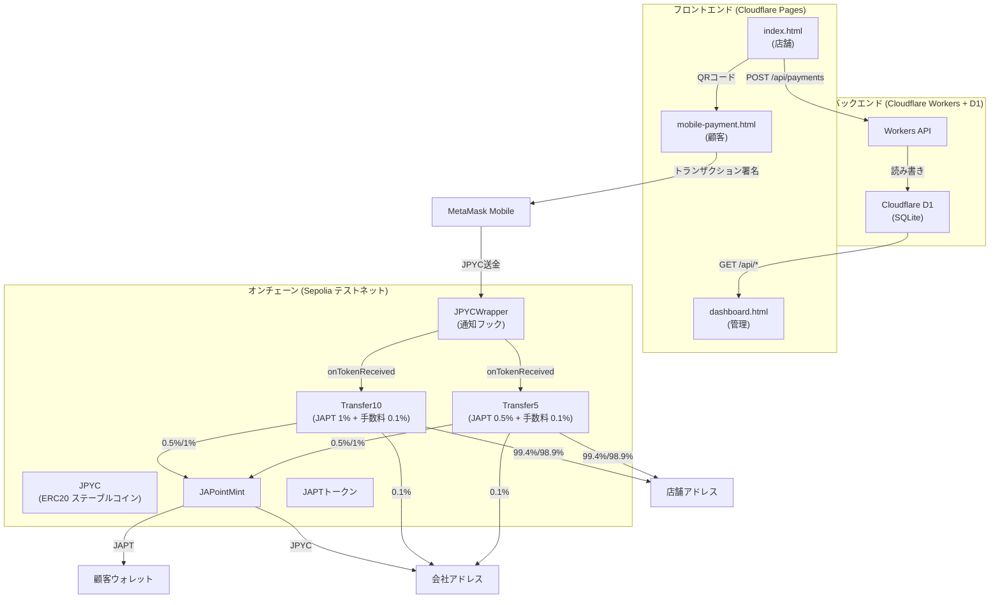
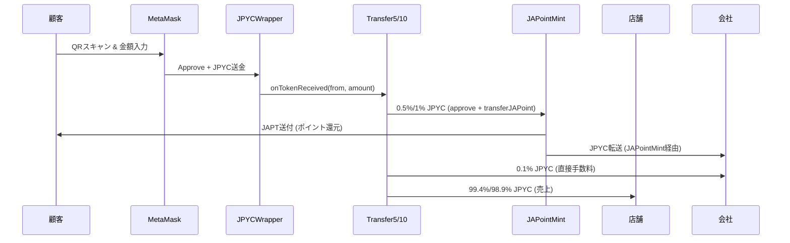
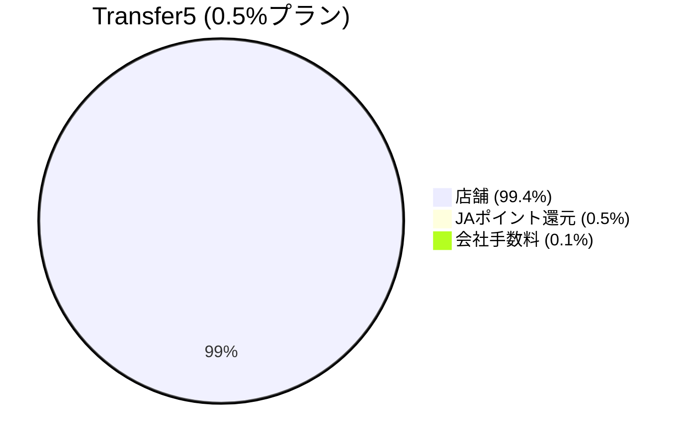
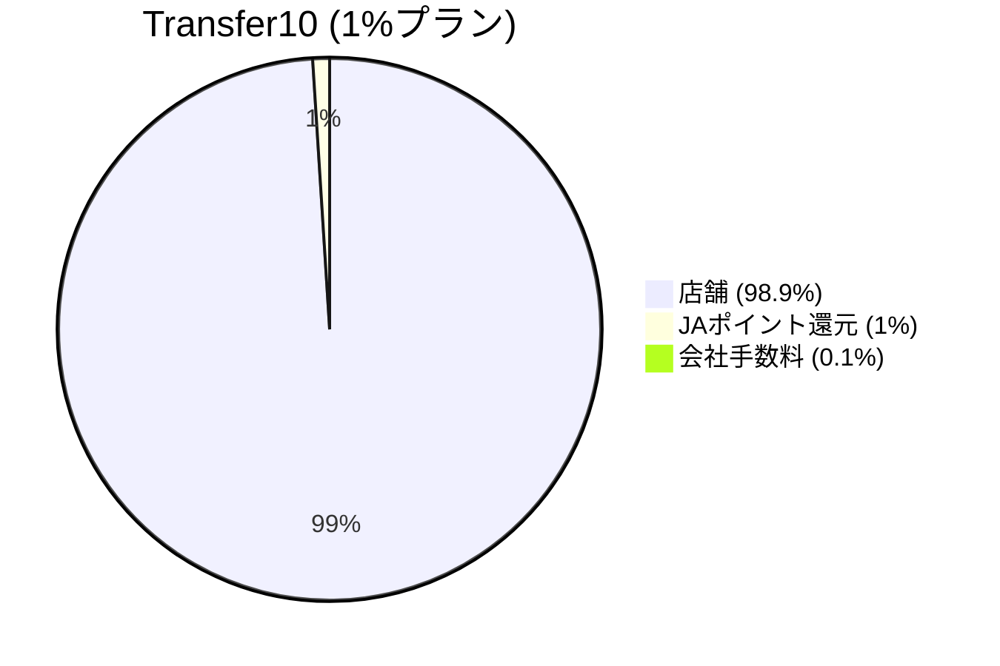

# JAPOINT 決済システム

SolidityとFoundryで構築された、ステーブルコイン決済とポイント還元システムです。顧客がJPYC（日本円ステーブルコイン）で支払うと、JAPT（JAPoint）トークンがポイントとして還元されます。

## ライブデモ

- **決済システム**: https://japoint-payment.pages.dev
- **API**: https://japoint-api.kkuejo.workers.dev

## システムアーキテクチャ



## 決済フロー



## 資金分配





## 技術スタック

### フロントエンド
| 技術 | 用途 |
|------|------|
| HTML/CSS/JavaScript | ユーザーインターフェース |
| ethers.js | Ethereum連携 (v5.7.2 モバイル, v6.9.0 デスクトップ) |
| QRCode.js | QRコード生成 |
| Cloudflare Pages | ホスティング |

### バックエンドAPI
| 技術 | 用途 |
|------|------|
| Cloudflare Workers | サーバーレスAPI |
| Cloudflare D1 | SQLiteデータベース |
| Wrangler | デプロイツール |

### スマートコントラクト
| 技術 | 用途 |
|------|------|
| Solidity ^0.8.20 | コントラクト言語 |
| OpenZeppelin | セキュリティライブラリ |
| Foundry | 開発・テスト |

### ネットワーク
| 項目 | 値 |
|------|-----|
| チェーン | Ethereum Sepolia テストネット |
| Chain ID | 11155111 |

## スマートコントラクト

### コントラクト概要

| コントラクト | 用途 | 手数料 |
|------------|------|--------|
| JPYC | 日本円ステーブルコイン（既存） | - |
| JAPT (JAPoint) | ポイントトークン（ERC20） | - |
| JPYCWrapper | JPYC転送に通知機能を追加 | - |
| Transfer5 | 決済処理（低手数料） | 0.6%（JAPT 0.5% + 手数料 0.1%） |
| Transfer10 | 決済処理（高還元） | 1.1%（JAPT 1% + 手数料 0.1%） |
| JAPointMint | JAPTポイント配布、JPYCを会社に転送 | - |

### デプロイ済みアドレス（Sepolia）

| コントラクト | アドレス |
|------------|---------|
| JPYC | `0xE7C3D8C9a439feDe00D2600032D5dB0Be71C3c29` |
| JAPoint (JAPT) | `0x0db3A45B333112a34fF81eE9B6A86AC1385d37C4` |
| JAPointMint | `0x9696781942f653c02c8Cded215bd182239867C96` |
| JPYCWrapper | `0xe2B4699B5CEf82d85a7Fa4B83adeA7268547Ced4` |
| Transfer10 | `0x674728add6Fb268b7EAfE8ABd214DD50Fb72b86B` |
| Transfer5 | `0xB60D10529e645e1AF85F7411Bce67d35bf71eA1E` |

### 設定アドレス

| 役割 | アドレス |
|------|---------|
| 会社 | `0x79a1cE843bA4Aa4Bd833D91c925789f242Ea1F84` |
| 店舗 | `0x7Abe610C0d12C261A281d4eDD8A68796fd044d90` |

## フロントエンドページ

| ファイル | 用途 |
|---------|------|
| `index.html` | 店舗ダッシュボード（QR生成、決済通知） |
| `mobile-payment.html` | 顧客用決済ページ（モバイル最適化） |
| `dashboard.html` | 管理ダッシュボード（決済履歴、日次統計） |
| `qr-codes-display.html` | 印刷用QRコード（プラン比較付き） |
| `qr-generator.html` | QRコードジェネレーター（カスタム設定） |

## APIエンドポイント

ベースURL: `https://japoint-api.kkuejo.workers.dev`

| メソッド | エンドポイント | 説明 |
|---------|--------------|------|
| POST | `/api/payments` | 決済を記録 |
| GET | `/api/payments` | 決済履歴を取得（フィルタ対応） |
| GET | `/api/payments/summary` | プラン別集計サマリーを取得 |
| GET | `/api/payments/daily` | 日別集計を取得 |
| GET | `/api/health` | ヘルスチェック |

## 開発

### 前提条件

- [Foundry](https://book.getfoundry.sh/getting-started/installation)
- [Wrangler CLI](https://developers.cloudflare.com/workers/wrangler/install-and-update/)
- Node.js 18+

### スマートコントラクト開発

```bash
# コントラクトをビルド
forge build

# テストを実行（33テスト）
forge test

# Sepoliaにデプロイ
source .env
forge script script/DeployFullSystem.s.sol \
  --rpc-url $SEPOLIA_RPC_URL \
  --broadcast --verify -vvv
```

### Workers API開発

```bash
cd workers

# ローカル開発
wrangler dev

# デプロイ
wrangler deploy

# D1データベースセットアップ
wrangler d1 execute japoint-payments --remote --file=schema.sql
```

### フロントエンドデプロイ

```bash
cd workers
CLOUDFLARE_ACCOUNT_ID=<アカウントID> \
  wrangler pages deploy /path/to/JAPOINT \
  --project-name japoint-payment \
  --branch gh-pages
```

## デプロイ情報

| サービス | URL / ID |
|---------|---------|
| Cloudflare Pages | https://japoint-payment.pages.dev |
| Cloudflare Workers | https://japoint-api.kkuejo.workers.dev |
| D1 Database | `15ff8ac7-fea5-491b-adf3-dcca95c5534c` |

## プロジェクト構成

```
.
├── src/                      # スマートコントラクト
│   ├── JAPoint.sol           # JAPTポイントトークン (ERC20)
│   ├── JAPointMint.sol       # JAPT配布 + JPYC転送
│   ├── JPYCWrapper.sol       # JPYC通知ラッパー
│   ├── Transfer10.sol        # JAPT 1% + 手数料 0.1% 決済処理
│   ├── Transfer5.sol         # JAPT 0.5% + 手数料 0.1% 決済処理
│   └── ITokenReceiver.sol    # トークン受信通知インターフェース
├── test/                     # コントラクトテスト（33テスト）
│   ├── Transfer10.t.sol      # Transfer10テスト（19テスト）
│   ├── JAPointMint.t.sol     # JAPointMintテスト（14テスト）
│   └── mocks/MockJPYC.sol    # テスト用MockJPYC
├── script/                   # デプロイスクリプト
│   ├── DeployFullSystem.s.sol # フルシステムデプロイ
│   └── TestAutomation.s.sol  # 自動テストスクリプト
├── workers/                  # Cloudflare Workers API
│   ├── src/index.js          # APIエンドポイント
│   ├── schema.sql            # D1データベーススキーマ
│   └── wrangler.toml         # Workers設定
├── index.html                # 店舗ダッシュボード
├── mobile-payment.html       # モバイル決済ページ
├── dashboard.html            # 管理ダッシュボード
├── qr-codes-display.html     # 印刷用QRコード
├── qr-generator.html         # QRコードジェネレーター
└── add-japt.html             # JAPT MetaMask登録
```

## ライセンス

MIT
