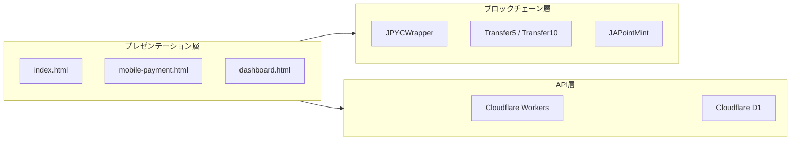
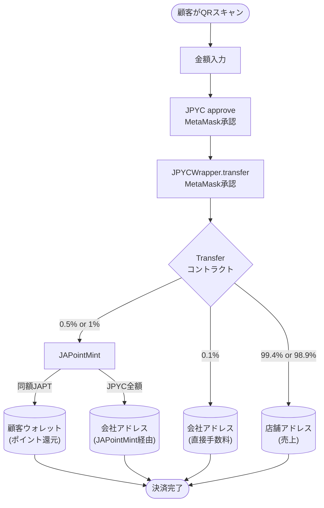
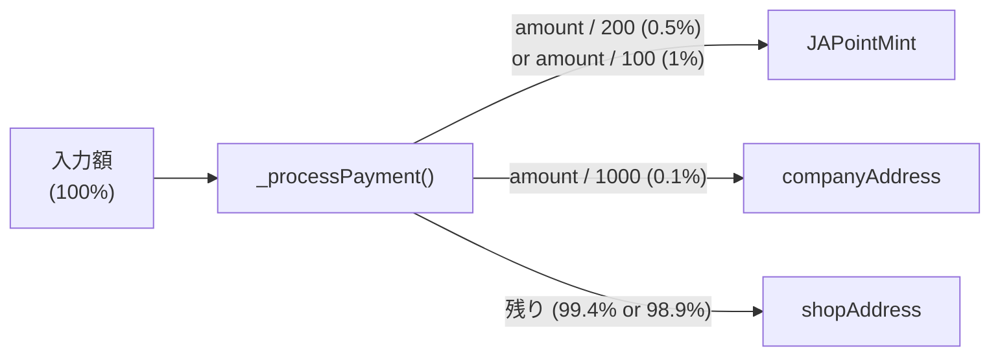
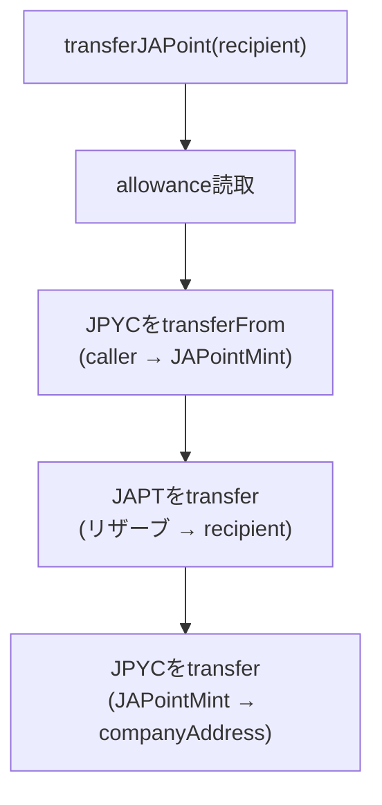
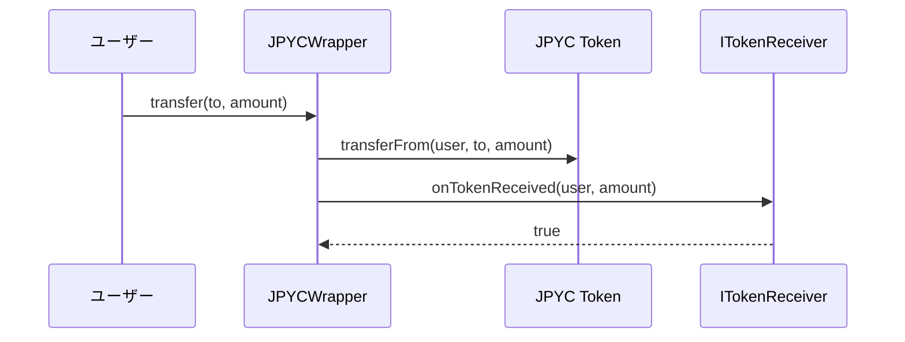
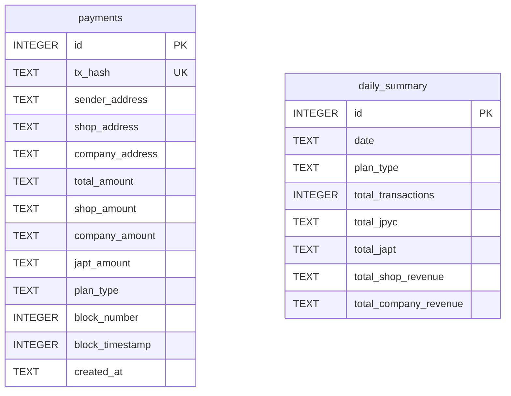
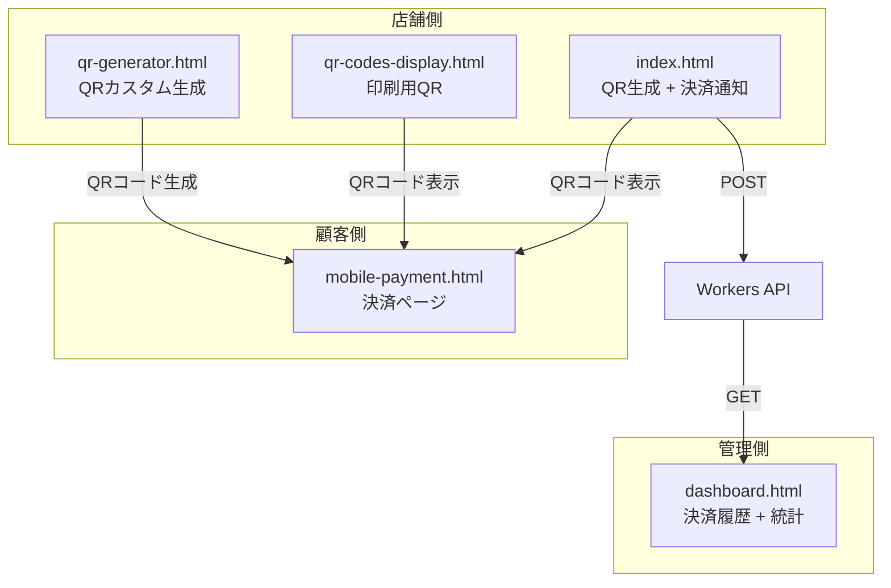
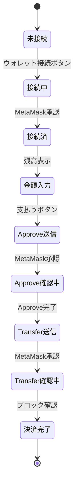
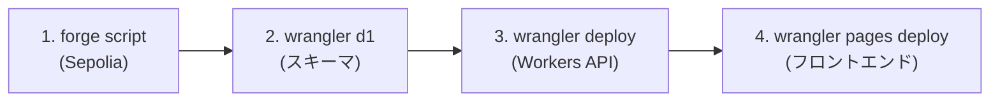

# JAPOINT 技術仕様書

## 1. システム概要

JAPointは、JPYC（日本円ステーブルコイン）を用いた店舗決済において、顧客にJAPT（JAPoint）トークンをポイントとして自動還元するシステムです。決済処理はすべてオンチェーンで実行され、APIは履歴・集計のみを担い、金銭のカストディは行いません。

### 1.1 設計原則

- **ノンカストディアル**: コントラクトに資金が滞留しない（即時分配）
- **自動処理**: JPYCWrapper経由の送金で自動的に決済処理が完了
- **透明性**: すべての取引がSepoliaブロックチェーン上で検証可能
- **シンプルUI**: QRコードスキャン → 金額入力 → 1回の承認で決済完了

## 2. アーキテクチャ

### 2.1 レイヤー構成



### 2.2 データフロー



## 3. スマートコントラクト仕様

### 3.1 コントラクト一覧

| コントラクト | Solidity | 責務 |
|------------|----------|------|
| JAPoint.sol | ERC20, Ownable | JAPTトークン（発行・焼却可能） |
| JAPointMint.sol | Ownable | JPYC受取 → JAPT配布 + JPYC会社転送 |
| JPYCWrapper.sol | - | JPYC送金時にITokenReceiver通知を発火 |
| Transfer5.sol | Ownable, ITokenReceiver | 0.5% JAPoint + 0.1% 手数料の決済処理 |
| Transfer10.sol | Ownable, ITokenReceiver | 1% JAPoint + 0.1% 手数料の決済処理 |
| ITokenReceiver.sol | Interface | onTokenReceived(address, uint256) |

### 3.2 Transfer5 / Transfer10 資金分配



#### Transfer5 の計算式

```solidity
japointMintAmount = amount / 200;              // 0.5%
feeAmount         = amount / 1000;             // 0.1%
shopAmount        = amount - japointMintAmount - feeAmount; // 99.4%
```

#### Transfer10 の計算式

```solidity
japointMintAmount = amount / 100;              // 1%
feeAmount         = amount / 1000;             // 0.1%
shopAmount        = amount - japointMintAmount - feeAmount; // 98.9%
```

### 3.3 JAPointMint の処理フロー



### 3.4 JPYCWrapper の通知メカニズム



### 3.5 イベント定義

#### PaymentProcessed（Transfer5/Transfer10）

```solidity
event PaymentProcessed(
    address indexed sender,    // 支払者アドレス
    uint256 totalAmount,       // 総額
    uint256 japointMintAmount, // JAPointMint送金額 (0.5%/1%)
    uint256 feeAmount,         // 会社手数料 (0.1%)
    uint256 shopAmount         // 店舗送金額 (99.4%/98.9%)
);
```

#### Minted（JAPointMint）

```solidity
event Minted(
    address indexed user,      // 呼び出し元 (Transfer5/10)
    address indexed recipient, // JAPT受取者 (顧客)
    uint256 amount             // JAPT発行額
);
```

### 3.6 デプロイ済みアドレス

| コントラクト | Sepolia アドレス |
|------------|-----------------|
| JPYC | `0xE7C3D8C9a439feDe00D2600032D5dB0Be71C3c29` |
| JAPoint (JAPT) | `0x0db3A45B333112a34fF81eE9B6A86AC1385d37C4` |
| JAPointMint | `0x9696781942f653c02c8Cded215bd182239867C96` |
| JPYCWrapper | `0xe2B4699B5CEf82d85a7Fa4B83adeA7268547Ced4` |
| Transfer10 | `0x674728add6Fb268b7EAfE8ABd214DD50Fb72b86B` |
| Transfer5 | `0xB60D10529e645e1AF85F7411Bce67d35bf71eA1E` |
| Company Address | `0x79a1cE843bA4Aa4Bd833D91c925789f242Ea1F84` |
| Shop Address | `0x7Abe610C0d12C261A281d4eDD8A68796fd044d90` |

## 4. バックエンドAPI仕様

### 4.1 構成

- **ランタイム**: Cloudflare Workers（サーバーレス）
- **データベース**: Cloudflare D1（SQLite互換）
- **CORS**: 許可オリジンをenv設定で管理

### 4.2 エンドポイント

#### POST /api/payments

決済トランザクションを記録する。

**リクエストボディ:**
```json
{
  "txHash": "0x...",
  "senderAddress": "0x...",
  "shopAddress": "0x...",
  "companyAddress": "0x...",
  "totalAmount": "1000.0",
  "shopAmount": "994.0",
  "companyAmount": "6.0",
  "japtAmount": "5.0",
  "planType": "transfer5",
  "blockNumber": 12345678,
  "blockTimestamp": 1700000000
}
```

**レスポンス:** `201 Created`
```json
{ "success": true, "txHash": "0x..." }
```

#### GET /api/payments

決済履歴を取得する。

**クエリパラメータ:**
| パラメータ | 説明 |
|-----------|------|
| `sender` | 送信者アドレスで絞込 |
| `shop` | 店舗アドレスで絞込 |
| `planType` | `transfer5` or `transfer10` |
| `from` | 開始日 (ISO 8601) |
| `to` | 終了日 (ISO 8601) |
| `limit` | 取得件数（デフォルト100、最大1000） |
| `offset` | オフセット |

#### GET /api/payments/summary

プラン別の集計サマリーを返す。

**レスポンス:**
```json
{
  "totals": {
    "transactionCount": 150,
    "totalJpyc": 5000000,
    "totalJapt": 35000,
    "totalShopRevenue": 4965000,
    "totalCompanyRevenue": 35000
  },
  "byPlanType": {
    "transfer5": { ... },
    "transfer10": { ... }
  }
}
```

#### GET /api/payments/daily

日別集計を返す（最大365日）。

### 4.3 データベーススキーマ



## 5. フロントエンド仕様

### 5.1 ページ構成と役割



### 5.2 決済ページ（mobile-payment.html）

顧客がQRコードをスキャンして開くモバイル最適化ページ。

**URLパラメータ:**
| パラメータ | 説明 |
|-----------|------|
| `jpyd` | JPYCトークンアドレス |
| `wrapper` | JPYCWrapperアドレス |
| `target` | Transfer5/10アドレス |
| `japt` | JAPTトークンアドレス |
| `type` | `transfer5` or `transfer10` |
| `shop` | 店舗名 |

**処理フロー:**



### 5.3 店舗ダッシュボード（index.html）

**機能:**
- QRコード生成（Transfer5/Transfer10切替）
- PaymentProcessedイベントのリアルタイム監視
- 決済通知の表示・履歴管理
- Workers APIへの決済記録送信

**イベント監視:**
```
ethers.JsonRpcProvider → Contract.on('PaymentProcessed')
→ addNotification() + savePaymentToAPI()
```

## 6. セキュリティ

### 6.1 オンチェーン

- OpenZeppelin Ownable によるアクセス制御
- `require` による入力検証
- `onTokenReceived` はJPYCWrapperからの呼び出しのみ許可
- `recoverTokens` による緊急トークン回収（Owner限定）

### 6.2 API

- CORS設定による許可オリジン制限
- D1プリペアドステートメントによるSQLインジェクション防止
- txHashのUNIQUE制約による重複記録防止

### 6.3 フロントエンド

- MetaMaskによるトランザクション署名（秘密鍵はユーザー管理）
- Sepoliaネットワーク検出と自動切替

## 7. テスト

### 7.1 テスト概要

全33テスト（Foundry）

| テストファイル | テスト数 | 対象 |
|--------------|---------|------|
| Transfer10.t.sol | 19 | 決済処理、資金分配、イベント発行 |
| JAPointMint.t.sol | 14 | JAPT配布、JPYC転送、アクセス制御 |

### 7.2 テスト実行

```bash
forge test -v
```

### 7.3 主要テストケース

- 正常決済（processPayment, deposit, onTokenReceived）
- 複数回決済の累積検証
- 少額・大額のエッジケース
- ファジングテスト（ランダム金額）
- コンストラクタバリデーション
- Owner権限の検証
- Permit付き自動送金

## 8. デプロイ

### 8.1 デプロイ手順



### 8.2 環境変数（.env）

| 変数 | 説明 |
|------|------|
| `PRIVATE_KEY` | デプロイウォレット秘密鍵 |
| `SEPOLIA_RPC_URL` | Sepolia RPCエンドポイント |
| `ETHERSCAN_API_KEY` | Etherscan認証キー（コントラクト検証） |
| `COMPANY_ADDRESS` | 会社の受取アドレス |
| `SHOP_ADDRESS` | 店舗の受取アドレス |

### 8.3 デプロイ先

| サービス | URL |
|---------|-----|
| フロントエンド | https://japoint-payment.pages.dev |
| バックエンドAPI | https://japoint-api.kkuejo.workers.dev |
| D1 Database ID | `15ff8ac7-fea5-491b-adf3-dcca95c5534c` |
